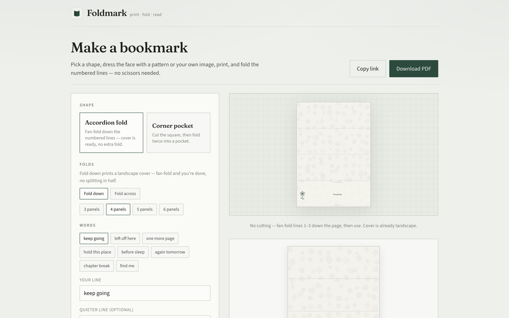
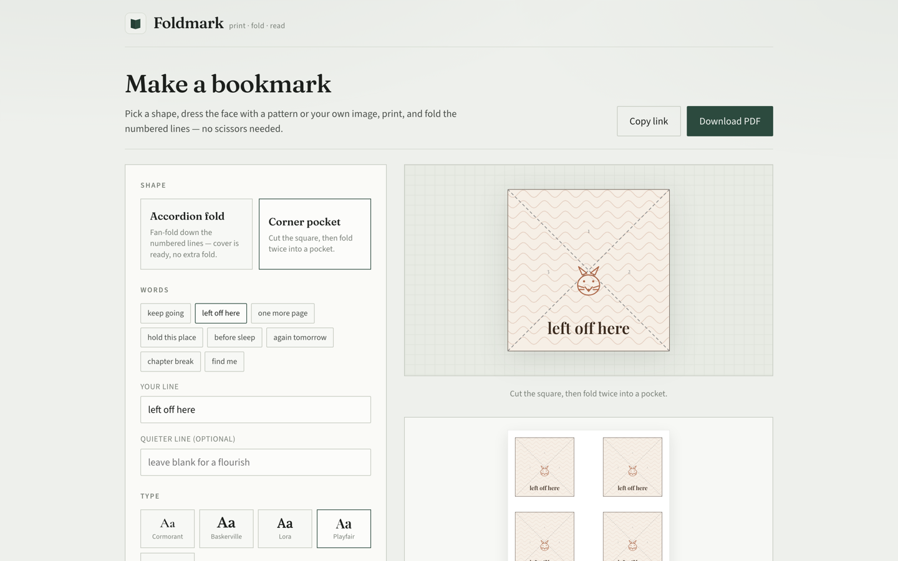
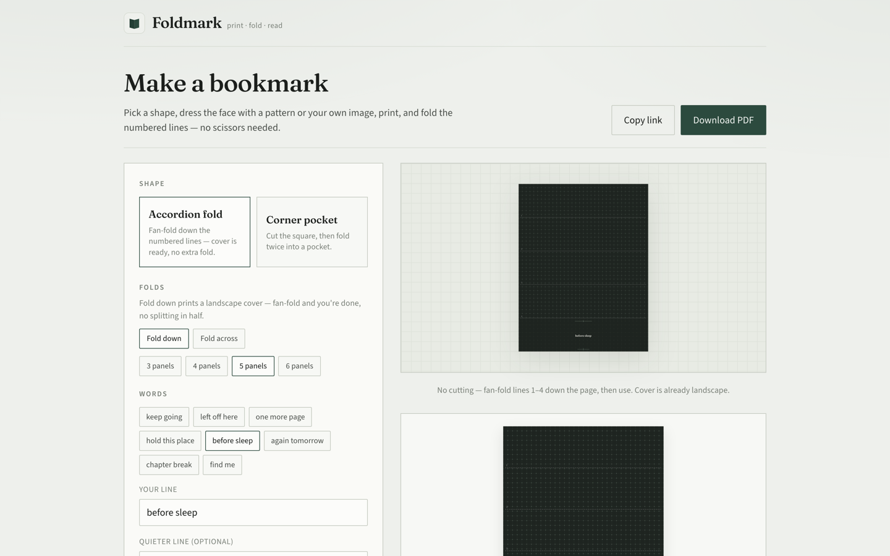

# Foldmark

A dead-simple printable bookmark maker.

Pick a shape, type your text, download a PDF, fold it. That's it.

**[foldmark.joelhanson.com](https://foldmark.joelhanson.com/)**



## Run locally

```bash
npm install
npm run dev
```

Open [http://localhost:3000](http://localhost:3000).

## Deploy

Any Node host works. On Vercel:

```bash
npx vercel
```

Or connect the GitHub repo in the Vercel dashboard — no special config required.

## Shapes

- **Accordion fold** — the whole sheet, fan-folded thick. Numbered fold lines, no scissors. Cover is landscape and ready after the fan-fold.
- **Corner pocket** — cut a square, fold twice into a triangular pocket that slides over the page corner.



## How it stays honest

The on-screen preview and the printed PDF are driven by the exact same layout
code (`src/lib/unitPlan.ts` + `src/lib/sheet.ts`): the same draw operations,
the same page-tiling math. What you see is what prints, by construction —
there's no separate hand-tuned drawing routine for each that can drift apart.

## Features

- Two shapes, five color palettes, color or black & white
- Patterns, motifs, or your own image on the face
- A4, Letter, A5, Legal — tiles as many copies as fit per sheet
- Shareable design links (URL state, no account)
- Client-side PDF generation — nothing is uploaded



## Stack

- Next.js (App Router)
- TypeScript
- `pdf-lib` for client-side PDF generation
